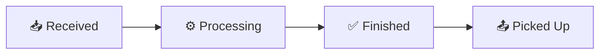
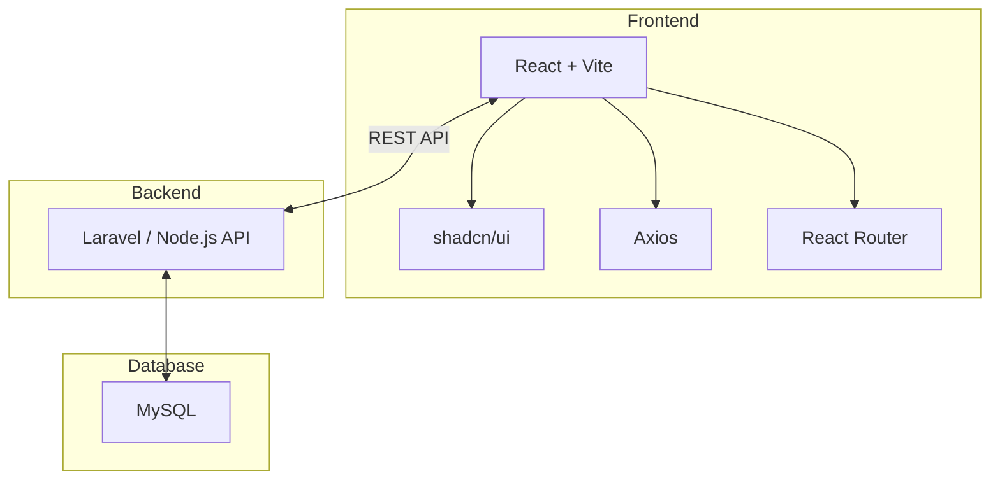

<p align="center">
  
</p>
<p align="center">
  <b>Sistem Manajemen Laundry Digital</b><br>
  Aplikasi untuk membantu usaha laundry mengelola pelanggan, transaksi, status cucian, nota, dan riwayat transaksi secara lebih mudah.
</p>

<p align="center">
  
  
  
  
  
  
</p>

---

## 📌 Tentang Project

**LaundryKu** adalah aplikasi manajemen laundry berbasis web yang dibuat untuk membantu pemilik usaha laundry dan karyawan dalam melakukan operasional harian.

Dengan LaundryKu, proses pencatatan laundry yang sebelumnya manual dapat dilakukan secara digital — mulai dari pelanggan masuk hingga transaksi selesai — dengan tampilan yang modern dan mudah digunakan.

---

## ✨ Fitur

### 🔐 Authentication
| Fitur | Keterangan |
|-------|-----------|
| Login Owner | Akses penuh ke seluruh fitur |
| Login Karyawan | Akses terbatas sesuai role |
| Role Based Access | Keamanan data terjaga |

### 👤 Customer Management
- ➕ Tambah pelanggan baru
- ✏️ Edit data pelanggan
- 🗑️ Hapus pelanggan
- 📋 Riwayat transaksi per pelanggan

### 🧺 Transaction Management
- 📝 Membuat transaksi laundry
- 💰 Menghitung total harga otomatis
- 📦 Menyimpan detail cucian
- 🔍 Melihat detail transaksi

### 🔄 Status Cucian



### 🧾 Invoice / Nota
- 🖨️ Generate nota transaksi
- 💵 Detail pembayaran
- 🖨️ Cetak nota (print-ready)

### 📜 Riwayat Transaksi
- 📋 Seluruh riwayat transaksi
- 🔎 Filter berdasarkan tanggal
- 🔍 Pencarian data pelanggan

---

## 🏗️ Arsitektur Sistem



---

## 🛠️ Tech Stack

### Frontend
| Teknologi | Kegunaan |
|-----------|----------|
| **React.js** | Library UI utama |
| **Vite** | Build tool cepat |
| **shadcn/ui** | Komponen UI modern |
| **Tailwind CSS** | Styling utility-first |
| **Axios** | HTTP client |
| **React Router** | Routing SPA |
| **Lucide React** | Icons |

### Backend
| Teknologi | Kegunaan |
|-----------|----------|
| Laravel / Node.js | API server |
| JWT Authentication | Sistem login |
| REST API | Komunikasi data |

### Database
| Teknologi | Kegunaan |
|-----------|----------|
| MySQL | Database utama |

---

## 📂 Struktur Repository

```
LaundryKu
│
├── 📁 frontend
│   ├── 📁 src
│   │   ├── 📁 components/ui    # Komponen shadcn/ui
│   │   ├── 📁 pages            # Halaman aplikasi
│   │   ├── 📁 layouts          # Layout dashboard
│   │   ├── 📁 routes           # Konfigurasi routing
│   │   └── 📁 services         # API service (Axios)
│   ├── package.json
│   └── vite.config.js
│
├── 📁 backend
│   ├── 📁 controllers
│   ├── 📁 routes
│   ├── 📁 models
│   └── 📁 database
│
└── README.md
```

---

## 🚀 Instalasi

### Clone Repository
```bash
git clone https://github.com/Alif-Kopling/LaundryKu.git
cd LaundryKu
```

### Frontend Setup
```bash
cd frontend
npm install
npm run dev
```
Frontend berjalan di **`http://localhost:5173`**

### Backend Setup
```bash
cd backend
composer install          # Laravel
cp .env.example .env
php artisan key:generate
php artisan migrate
php artisan serve
```
Backend berjalan di **`http://localhost:8000`**

---

## 🔗 API Endpoint

| Method | Endpoint | Keterangan |
|--------|----------|-----------|
| `POST` | `/api/v1/auth/login` | Login user |
| `GET` | `/api/v1/customers` | Data pelanggan |
| `POST` | `/api/v1/customers` | Tambah pelanggan |
| `PUT` | `/api/v1/customers/{id}` | Edit pelanggan |
| `DELETE` | `/api/v1/customers/{id}` | Hapus pelanggan |
| `GET` | `/api/v1/transactions` | Data transaksi |
| `POST` | `/api/v1/transactions` | Buat transaksi |
| `PATCH` | `/api/v1/transactions/{id}/status` | Update status |
| `GET` | `/api/v1/transactions/{id}/invoice` | Detail nota |
| `GET` | `/api/v1/history` | Riwayat transaksi |

---

## 🌿 Git Branch Strategy

```
🌳 main (production)
  └── 🌱 develop (integration)
        ├── 🌿 feature/auth
        ├── 🌿 feature/dashboard
        ├── 🌿 feature/customer-page
        ├── 🌿 feature/transaction-page
        ├── 🌿 feature/invoice-page
        └── 🌿 feature/history-page
```

**Alur kerja:**
```
feature/*  →  develop  →  main
```

---

## 📝 Commit Convention

```
feat:       ✨ Fitur baru
fix:        🐛 Perbaikan bug
style:      💄 Perbaikan UI/styling
refactor:   ♻️ Refactor kode
docs:       📝 Dokumentasi
chore:      🔧 Tugas maintenance
```

**Contoh:**
```
feat: add login page with JWT auth
feat: create customer CRUD
fix: fix transaction validation
style: update dashboard layout
docs: add API documentation
```

---

## 👥 Tim Pengembang

| Role | Nama |
|------|------|
| **Frontend Developer** | Alif Kopling |
| **Backend Developer** | — |

---

## 🎯 Rencana Pengembangan

- [ ] 📱 Notifikasi WhatsApp untuk pelanggan
- [ ] 📱 QR Code tiap transaksi
- [ ] 📊 Dashboard analytics real-time
- [ ] 📑 Export laporan ke Excel
- [ ] 📱 Aplikasi Mobile

---

<p align="center">
  
  <br>
  Made with ❤️ by <b>LaundryKu Team</b>
  <br>
  <sub>Version 1.0.0</sub>
</p>
